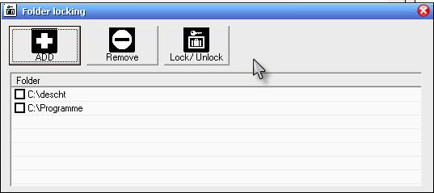



## Folder locking

### Description

Enables locking folders. App runs as service and isn&#180;t visible. By drag&#180;n&#180;drop or pushing the add button you can add folders.

To run this app properly - compile it, create a shortcut and add the shortcut with

-install

In the context menu of the windows explorer is a new submenu created - locking folder.

This app is the result of a lot of lines of code from psc. Thanks to all.
 
### More Info
 

             |
---                |---
**Submitted On**   |2007-06-15 08:51:44
**By**             |[Mario Grimm](https://github.com/Planet-Source-Code/PSCIndex/blob/master/ByAuthor/mario-grimm.md)
**Level**          |Intermediate
**User Rating**    |4.2 (21 globes from 5 users)
**Compatibility**  |VB 6\.0
**Category**       |[Complete Applications](https://github.com/Planet-Source-Code/PSCIndex/blob/master/ByCategory/complete-applications__1-27.md)
**World**          |[Visual Basic](https://github.com/Planet-Source-Code/PSCIndex/blob/master/ByWorld/visual-basic.md)
**Archive File**   |[Folder\_loc2070916152007\.zip](https://github.com/Planet-Source-Code/mario-grimm-folder-locking__1-68815/archive/master.zip)

